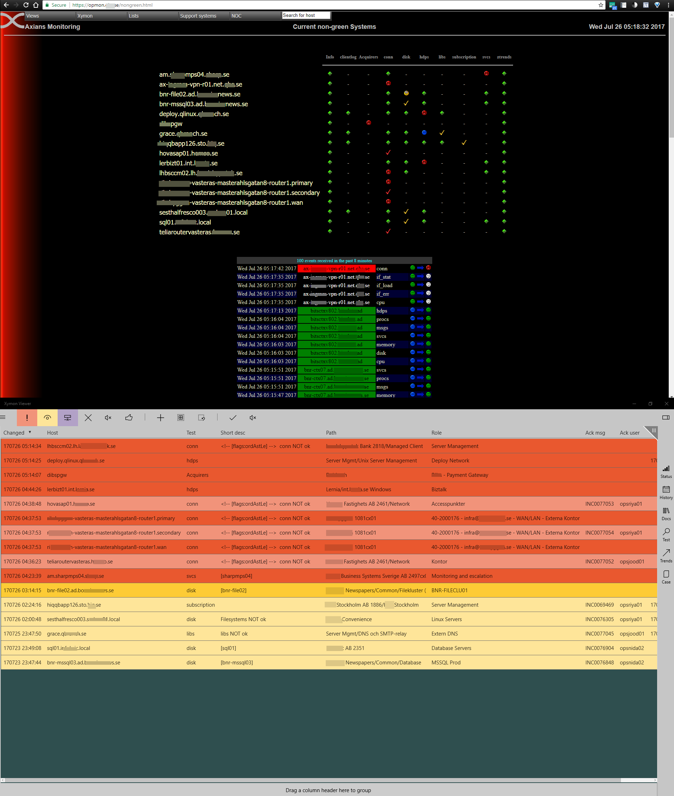
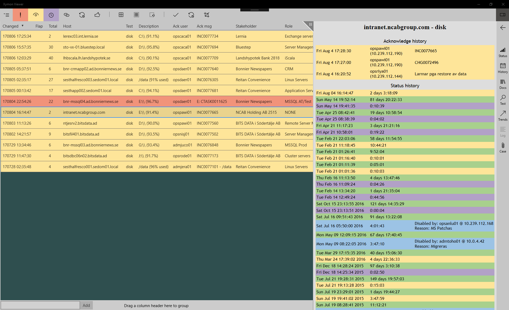
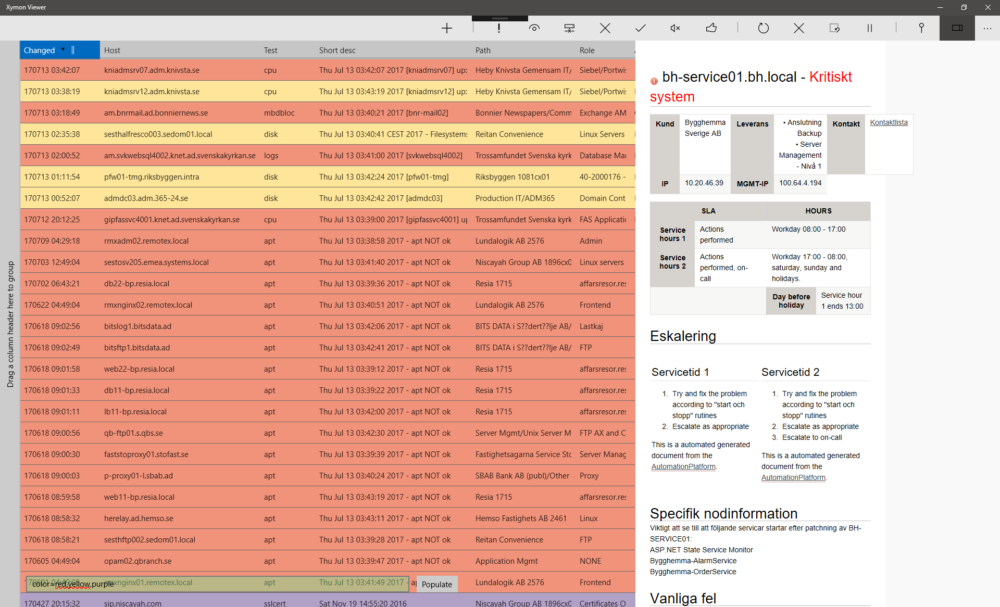
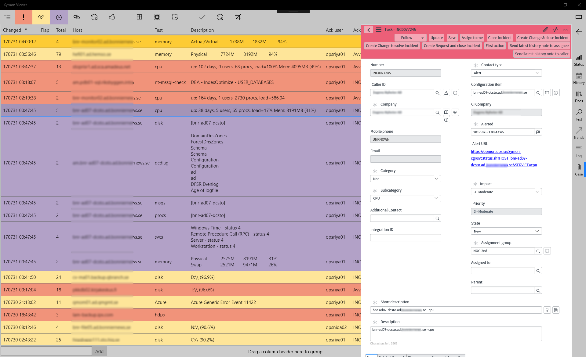

UWP frontend for live monitoring with Xymon Monitor in the style of Netcool or Netrac. Batch ack/disable events, sorting, filtering, history, etc. Inline web ticketing. 

### Compared to Xymon standard-gui

| | VfX         | Xymon web interface |
|---| ----------- | ----------- |
|Uppdatering| Live | Upp till 60s fördröjning
|Sortering| Senast inkommet (alt. valfri kolumn) | Alfabetisk ordning       |
|Nytt aktivt larm | Djup färg (och/eller fetstil)| Färgad emoji-ikon        |
|Hanterat aktivt larm | Blek färg, med ansvarig och  hanterings-status i resp. kolumn | Färgad bock-ikon |
|Fel-meddelande| I meddelande-kolumn | Bakom länk till status-sida (Emoji- el. bock-ikon) |
|Historik| I sidovy | Historik-länk på status-sidan |
|Nod-dokumentation | I sidovy | Skriv el. klipp/klistra nodnamn till dokumentations-söksida |
|Skapa/uppdatera ticket | I sidovy | Skriv el. klipp/klistra nodnamn till ticket-söksida |

### Inline history view

### Inline node documentation

### Inline case handling

